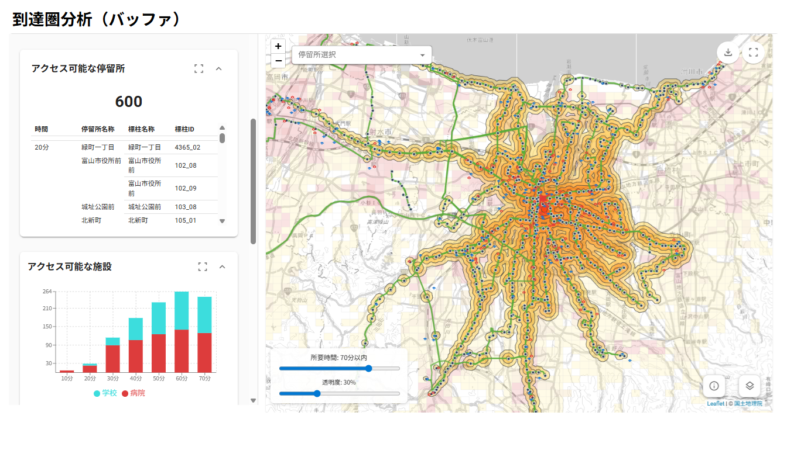

# 地域公共交通計画策定支援ツール「LINKS Mobilys」

## 更新履歴
| 更新日時 | リリース | 更新内容 |
| ---- | ---- | ---- |
| 2026/02/20 | 1st Release | 初版リリース |

## 1. 概要 
本リポジトリでは、国土交通省が推進する[Project LINKS](https://www.mlit.go.jp/links/)及び地域交通DXプロジェクト[COMmmmONS（コモンズ）](https://www.mlit.go.jp/commmmons/)が連携した2025年度の取組である「公共交通計画策定支援ツール開発プロジェクト」について、その成果物である地域公共交通計画策定支援ツール「LINKS Mobilys（リンクス モビリス）」のソースコードを公開しています。

「LINKS Mobilys」は、GTFSデータをはじめとした公共交通分野のオープンデータ等を活用し、地域交通の現状の可視化や需給バランスの評価を行うことで、地域公共交通計画をはじめとする交通政策の検討を支援するシステムです。

## 2. 「公共交通計画策定支援ツール開発プロジェクト」について 
[「公共交通計画策定支援ツール開発プロジェクト」](https://www.mlit.go.jp/commmmons/projectreport/12_01/)では、行政や交通事業者が保有する膨大な交通情報を活用し、地域公共交通計画や関連施策の立案を効率的かつ効果的に進められる環境を整備することを目的として、「LINKS Mobilys」を開発しました。 
現在、多くの行政・交通事業者においては、データフォーマットの不統一や分析作業に必要な専門知識が障壁となり、十分なデータ活用が進まないという課題があります。 こうした現状を踏まえ、職員自身が交通情報の可視化・分析・シミュレーションを容易に行える環境を提供することで、施策検討業務の高度化と効率化を支援します。 
本システムでは、COMmmmONS（コモンズ）が進める「モビリティ・データ標準化プロジェクト」と連携し、同プロジェクトが策定した[「乗降実績データ標準仕様書（鉄道・バス）」](https://www.mlit.go.jp/commmmons/document/005/)に対応することで円滑なデータ入力が可能となっています。  
また、国土交通省が定める公共交通運行情報の標準データ仕様である[「GTFS-JP」](https://www.mlit.go.jp/sogoseisaku/transport/sosei_transport_tk_000067.html)に対応しています。  
本システムは、地域の交通状況を多角的に把握するための公共交通サービスの可視化、需要変動を踏まえた分析、施策効果を検討するためのシミュレーション等の機能を実装しています。  
これにより、データに基づく計画立案の推進と、地域公共交通における持続可能なモビリティの実現に寄与することを目指しています。  
本システムの技術的な詳細については、技術検証レポート（2026年3月公開予定）を参照してください。

## 3. 利用手順 
本システムの[構築手順](./doc/devMan.md)及び利用手順については[利用マニュアル](https://www.mlit.go.jp/commmmons/document/008/commmmons_doc_008_ver01.pdf)を参照してください。

★環境構築手順に情報量が足りていない。  
・インフラ構成図（実装例）  
・利用するマネージドサービス一覧、インフラ設定ファイルの配布  
・各マネージドのデプロイ方法  
？ローカルホストへのデプロイが解説してあるようだが、あまり意味ない。商用レベルのプロダクトを想定しているため、普通のIaaSを用いたデプロイ解説にする。  
？今回はRDBもDocerに内包していると思われるが、実装例においてはRDSなどは外出ししているのでは？そのあたりのバックエンド構成についても解説が必要。  

## 4. システム概要 
### 【GTFSの分析・可視化】
#### ①バス路線や停留所の可視化
- GTFSデータリポジトリ又はローカルファイルからGTFSフィードを読み込みます。
- 読み込んだGTFSデータを基に停留所ごとの時刻表の表示や選択した路線が停車する停留所の一覧を表示することができます。

★ビジュアルを入れる★

#### ②運行頻度の可視化
- 地図表示による任意区間を走るバスの運行頻度を確認できます。
- バスダイヤは平日・休日等で異なるため、運行日の切り替えも可能です。
- 全日/任意の時間帯別で運行本数の集計範囲を設定できます。

★ビジュアルを入れる★

#### ③バス利用時の到達圏分析
- 任意地点を基準として、路線バスを利用した到達圏域を可視化することができます。
- 可視化においてはバス停からの徒歩圏を同心円での到達圏の表示や、バス停周辺の道路ネットワークを踏まえた到達圏の表示が可能です。

★ビジュアルを入れる★

#### ④停留所周辺の圏域分析
- 選択した公共交通路線のすべての停留所から指定した距離（徒歩圏）内の範囲を 「公共交通圏域」として可視化し、その圏域内にある施設や人口を集計します。 
- 地域全体での公共交通のカバー状況を一目で把握できます。

★ビジュアルを入れる★

### 【利用実態の分析・可視化】
#### ⑤乗降実績の可視化
- 事前に作成したCSV形式の乗降実績データ（各便の停留所で何人が乗り降りしたかを示すデータ）を読み込み、各バス停の乗降人数や乗車中人数を地図やグラフ、表で可視化します。

★ビジュアルを入れる★

#### ⑥ODデータの可視化
- 事前に作成したODデータ（停留所Aから停留所Bへの、移動人数を示すデータ）を読み込み、各バス停間の利用者数を可視化します。

★ビジュアルを入れる★

### 【GTFS編集・シミュレーション】

#### ⑦かんたん便数編集
- 既存のGTFSデータを基に、路線の運行本数を編集できます。
- 倍数による変更（×2で2倍、×0.5で半減等）や、増減数による変更（+5で5本増便等）が可能です。

★ビジュアルを入れる★

#### ⑧シナリオ編集
-  既存のGTFSデータを編集することができます。
-  グルーピング
    -  GTFSの可視化や分析に必要となる以下の項目をシステムが自動で解析し、分類やグルーピングを行います。
    - 停留所：stop_name/stop_idを参照し、近接する標柱を1つの停留所にグルーピングします。
    - 路線：route_shrt_name/route_long_nameを参照し、類似路線をグルーピングします。
    - 運行パターン：往復区分（direction_id）×運行日（service_id）×運行区間でパターンを分類します。
-  GTFSデータ編集
    - 専門知識を持たずとも、GTFS を直感的に編集できます。
    - agency.txt, feed_info.txt, stops.txt, routes.txt, trips.txt, stop_times.txt, calender.txt, calender_dates.txt, shapes.txt, translations.txtに含まれる情報を編集できます。
    - 編集したGTFSはZIPファイルとしてダウンロードできます。

★ビジュアルを入れる★    

#### ⑨シミュレーション
- 路線の運行本数を増減した場合の影響を、利用者数の変化、道路交通への影響、経済的便益、環境負荷など多角的に評価するシミュレーションツールです。
- 本シミュレーションでわかることは以下のとおりです。路線再編や増減便の検討における定量的な根拠資料の作成に活用できます。
    - 利用者数の変化: 増減便に伴う利用者数の増減と運賃収入への影響​
    - 道路交通への影響: 自動車交通量・走行速度・交通事故件数の変化​
    - 社会的便益: 走行時間短縮、走行経費削減、交通事故減少による便益
（円/年）
    - 運行収支:運賃収入の増減と運行コストの増減から算出される収支への影響​
    - 環境負荷: CO₂排出削減量​
- 本シミュレーションは以下のマニュアルを参考にしています。
    - 費用便益分析マニュアル（令和７年８月　国土交通省道路局　都市局）​
    - 鉄道プロジェクトの評価手法マニュアル（２０１２年改訂版（２０２５年３月一部変更）　国土交通省鉄道局）

### 【関連データインポート】
#### ⑩施設データインポート
- 医療機関や学校などの施設データをインポートし、地図上に可視化します。

#### ⑪一件明細データの変換
- ICカード履歴データの乗車・降車日時と停留所の情報を使用し、一件明細データの標準フォーマットを生成します。
- 生成にあたっては乗車した路線や便などを推定し、GTFSの情報と紐づけて補完します。

★もう少し具体的に説明する。標準仕様対応の乗降実績データをインポートすると、GTFSのStopなどと紐づけられる（Stop IDなどのフィールドを結合される？）という処理を具体的に書く。★
★ビジュアルを入れる★

#### ⑫乗降データの変換
- ⑪で作成した一件明細データから乗降データを作成します。

★乗降データ、とは何のこと？停留所単位のことか？具体的に定義・説明する★
★データレイアウト（テーブルの定義）を入れる★

#### ⑫ODデータの変換
- ⑪で作成した一件明細データからODデータを作成します。

★ODデータ、とは何のこと？具体的に定義・説明する★
★データレイアウト（テーブルの定義）を入れる★

## 5. 利用技術

| 種別              | 名称   | バージョン | 内容 |
| ----------------- | --------|-------------|-----------------------------|
| データベース | [PostgreSQL](https://www.postgresql.org/) | 15 | リレーショナルデータベース|
|            | [PostGIS](https://postgis.net/) | 3.3 | PostgreSQLに地理空間データの管理機能を拡張した地理空間データベース。 |
|      ライブラリ | [Leaflet](https://leafletjs.com/) | 1.9.4 | オープンソースの地図描画ライブラリ。JavaScriptで動作し、WebアプリやGISシステムに地図機能を組み込める。軽量で使いやすいライブラリを利用してWebで動的な地図を簡単に表示するために利用。 |
|       |[MUI(Material UI)](https://mui.com/material-ui/) | 7.1.2 | React向けのUIコンポーネントライブラリ。GoogleのMaterial Designガイドラインに基づいてデザインされており、モダンなUIを簡単に構築できる。|
|       | [React](https://ja.react.dev/) | 19.2.1 | 画像処理・画像解析を行うライブラリ。 |
|| [MobilityData GTFS Validator](https://gtfs-validator.mobilitydata.org/)| 6.2.0 | GTFSに含まれる各種ファイルが仕様に沿って正しく記述されているかを自動でチェックするツールアプリ。 |
| 経路検索エンジン| [OSRM](https://project-osrm.org/) | 6.0.0 | 経路検索を行うエンジン。 |
|       | [OpenTripPlanner](https://www.opentripplanner.org/) | 19.2.1 | フロントエンドのフレームワーク。 |
|フレームワーク | [Django](https://www.djangoproject.com/) | 5.2 | Webフレームワーク、RESTful API実装。 |
|コンテナ|[Docker](https://www.docker.com/ja-jp/) | 28.1.1 | 仮想環境で実行するためのプラットフォーム。|

## 6. 動作環境 
| 項目 | 最小動作環境| 推奨動作環境  | 
| ------------------ | ----------------------------------------------------------------------------------------------------------------------------------------------------------------------------------------------------------------------------------------------------------------------------------------------------------------------------------------------- | ------------------------------ | 
| OS| Microsoft Windows 10 または11|  同左 | 
| CPU  | Intel Core i5以上| Intel Core i7以上| 
| メモリ| 8GB以上  | 16GB以上 | 
| ディスプレイ解像度 | 1024×768以上  | 同左 | 
| ネットワーク       | 地図表示機能を使用する場合、以下のURLを閲覧できる環境が必要 
・地理院地図（国土地理院）　 http://cyberjapandata.gsi.go.jp ・標準地図 https://cyberjapandata.gsi.go.jp/xyz/std/{z}/{x}/{y}.png ・淡色地図 https://cyberjapandata.gsi.go.jp/xyz/pale/{z}/{x}/{y}.png ・白地図 https://cyberjapandata.gsi.go.jp/xyz/blank/{z}/{x}/{y}.png ・写真 https://cyberjapandata.gsi.go.jp/xyz/seamlessphoto/{z}/{x}/{y}.jpg  GTFSデータリポジトリに登録されているGTFSデータをインポートする機能を使用する場合、以下のAPIが利用できる環境が必要 ・GTFSデータリポジトリ http://docs.gtfs-data.jp/api.v2.html  人口メッシュデータを表示する場合、以下のAPIが利用できる環境が必要 ・e-Stat https://www.e-stat.go.jp/mypage/user/preregister  関連データとして医療機関と学校のデータを表示する場合、以下のAPIが利用できる環境が必要 ・国土交通データプラットフォーム https://data-platform.mlit.go.jp/api_docs/|  同左                            | 

## 7. 本リポジトリのフォルダ構成 
| フォルダ名 |　詳細 |
|-|-
| mobilys-be | バックエンド処理 |
| mobilys-fe | フロントエンド処理 |
| mobilys-otp | 到達圏分析での経路探索処理 |
| mobilys-gtfs-validator | GTFSのバリデーションチェック処理 |
| SampleData | サンプルデータ |

## 8. ライセンス 

- ソースコード及び関連ドキュメントの著作権は国土交通省に帰属します。

## 9. 注意事項 

- 本リポジトリは参考資料として提供しているものです。動作保証は行っていません。
- 本リポジトリについては予告なく変更又は削除をする可能性があります。
- 本リポジトリの利用により生じた損失及び損害等について、国土交通省はいかなる責任も負わないものとします。

## 10. 参考資料 
- 公共交通計画策定支援ツール開発プロジェクト　プロジェクトレポート
  - #1　https://www.mlit.go.jp/commmmons/projectreport/12_01/

- 地域公共交通計画策定支援ツール開発技術検証レポート（2026年3月公開予定）

- 公共交通運行情報標準データ仕様書（GTFS-JP）v4（2026年3月公開予定）
