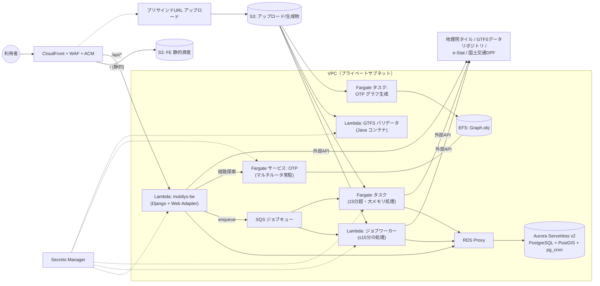

# サーバレスアーキテクチャ設計書（LINKS Mobilys / EC2 → Lambda・Fargate 移行）

本書は [AI駆動開発 実行計画書](./AI_DRIVEN_DEV_PLAN.md) 第5章の詳細設計です。現行の EC2 単一インスタンス構成（[devMan.md](./devMan.md) 第3章）を、**AWS Lambda を第一候補、Lambda の制約に適合しないものは AWS Fargate** とするサーバレス構成へ移行します。

## 1. 設計方針

1. **Lambda ファースト**: リクエスト/レスポンス型・バッチ型の処理は Lambda（コンテナイメージ）で実行する。
2. **Fargate は例外扱い**: 「常駐プロセスが必須」「実行時間15分超」「メモリ10GB超」のいずれかに該当する場合のみ Fargate を使う。
3. **ステートはマネージドサービスへ**: ローカルディスク前提の状態（アップロードファイル、OTP の Graph.obj、nginx 動的設定、ブートストラップ済みマーカー）をすべて S3 / EFS / DB / SSM に外出しする。
4. **コンテナイメージの再利用**: 既存の Dockerfile 群を活かし、Lambda もコンテナイメージデプロイとすることで、ローカル docker compose 開発と本番の乖離を最小化する。
5. **すべて IaC 管理**: `infra/` ディレクトリ（AWS CDK または Terraform）で全リソースを定義し、コンソール手作業を排除する。

### Lambda 適合性の判断基準（本書共通）

| 制約 | Lambda の上限 | 超過時の移行先 |
| --- | --- | --- |
| 実行時間 | 15分 | Fargate タスク（RunTask） |
| メモリ | 10,240 MB | Fargate タスク |
| コンテナイメージ | 10 GB | イメージ分割 or Fargate |
| 同期レスポンス | 6 MB（API Gateway 経由はタイムアウト29〜30秒） | 非同期化 + S3 経由の受け渡し |
| 常駐プロセス・Docker 操作 | 不可 | Fargate サービス / ECS API |
| 一時ディスク（/tmp） | 最大 10 GB（エフェメラル） | EFS マウント or Fargate |

## 2. コンポーネント別の移行設計

### 2-1 mobilys-fe → S3 + CloudFront

- Vite ビルド成果物（静的ファイル）を S3 に配置し、CloudFront（OAC）で配信。nginx コンテナは廃止。
- **API を同一オリジン化**: CloudFront に `/api/*` ビヘイビアを追加してバックエンドへ転送する。これにより `VITE_API_BASE_URL` は相対パス `/api` となり、devMan.md 3-4 の「EC2 の IP を sed で埋め込む」手順、および CORS / `CSRF_TRUSTED_ORIGINS` の IP 依存設定が不要になる。
- HTTPS は CloudFront + ACM で終端（現行構成の HTTP 平文公開を解消）。WAF（AWS WAF マネージドルール）を CloudFront に適用。

### 2-2 mobilys-be → Lambda（同期 API）+ SQS/Fargate（長時間ジョブ）

**同期 API（Lambda）**

- Django + gunicorn の既存構成を **AWS Lambda Web Adapter** を組み込んだコンテナイメージとしてそのまま Lambda 化する（WSGI アプリの書き換え不要）。
- 経路: CloudFront `/api/*` → Lambda Function URL（OAC 保護）または API Gateway HTTP API。
- DB 接続は **RDS Proxy** 経由とし、Lambda スケール時の接続枯渇を防ぐ。
- コールドスタート対策: geopandas / osmnx を含むイメージは初期化が重いため、(1) 依存を API 用と分析ジョブ用に分割してイメージを軽量化、(2) 必要に応じて Provisioned Concurrency を最小数設定。
- 起動時処理の分離: `entrypoint.sh` が行っている `migrate` / `bootstrap_visualization_data.py` / `populate_initial_data` は **リクエストパスから排除** し、デプロイパイプラインの専用ステップ（1回限りの Lambda 呼び出しまたは Fargate タスク）として実行する。`/app/.visualization_data_bootstrapped` 等のマーカーファイル方式は SSM Parameter Store のフラグに置換する。

**長時間ジョブ（SQS + Lambda / Fargate タスク）**

現行 `gunicorn --timeout 900` が示す長時間同期処理（GTFS インポート・解析、乗降実績データ変換、シミュレーション、到達圏計算の前処理等）は、API Gateway/CloudFront のタイムアウトに収まらないため非同期ジョブへ分離する。

```
FE → POST /api/jobs（Lambda: ジョブ受付・SQS enqueue・job_id 返却）
   → SQS → ジョブワーカー（Lambda ／ 15分・10GB 超の見込みがあるものは Fargate RunTask）
   → 結果を S3 / DB に保存、ステータスを DB に記録
FE → GET /api/jobs/{id}（ポーリング）で進捗・結果取得
```

- Phase 2 冒頭で **実データ規模（県単位 GTFS・年間乗降実績）での処理時間・メモリを計測** し、ジョブ種別ごとに Lambda / Fargate を確定する。判断基準は第1章の表のとおり。
- ファイルの受け渡しは S3 に統一する。アップロード（GTFS zip 最大300MB、乗降実績 CSV）は **S3 プリサインド URL 方式** とし、API 経由のマルチパートアップロードを廃止する（Lambda の 6MB ペイロード制約回避、かつ BE の負荷軽減）。

### 2-3 db → Aurora Serverless v2（PostgreSQL / PostGIS）

- PostgreSQL 15 互換の **Aurora Serverless v2** を採用。PostGIS・`pg_cron`・`pg_stat_statements` はいずれも Aurora PostgreSQL でサポートされる（`pg_cron` はクラスタパラメータグループの `shared_preload_libraries` に設定。現行 `docker-compose.yml` の `command` 指定パラメータをパラメータグループへ移植する）。
- 容量は ACU の下限/上限で制御し、開発環境はアイドル時の自動一時停止（0 ACU スケール）でコストを抑える。
- 認証情報は Secrets Manager 管理＋自動ローテーション。`docker-compose.yml` の `POSTGRES_PASSWORD: admin` のようなハードコードを全廃する。
- 移行は `pg_dump` / `pg_restore`（PostGIS 拡張を先に有効化）で行い、切替前に特性テストで検証する。

### 2-4 mobilys-gtfs-validator → Lambda（Java コンテナ・非同期）

- 実体は「zip を受け取り Java CLI（`gtfs-validator-cli.jar`）を1回実行して JSON を返す」バッチ処理であり Lambda に適合する。FastAPI ラッパを外し、**S3 イベントまたはジョブキュー起点の Lambda（Java 11 ランタイムを含むコンテナイメージ、メモリ 8〜10GB でヒープ 4G を確保）** として再実装する。
- 現行の `VALIDATOR_TIMEOUT_SECONDS=900` は Lambda 上限（900秒）と同値のため、**Phase 2 で最大想定 GTFS（300MB）の検証時間を実測** し、余裕（実測値×2 < 15分）が取れない場合は同一イメージのまま Fargate タスクへ切り替える（コンテナイメージを共用できるため切替コストは小さい）。
- 入出力はともに S3（入力 zip / 出力レポート JSON）とし、BE はジョブテーブルで結果を参照する。`MAX_CONCURRENT_JOBS=1` のセマフォは不要になる（Lambda の同時実行数制御に置換）。

### 2-5 mobilys-otp → Fargate（Lambda 不可）

現行実装は FastAPI オーケストレータが `/var/run/docker.sock` を使って GTFS ごとに OTP ルータコンテナを起動し（`app/infra/docker.py`・`app/services/router_manager.py`）、nginx の設定ファイルを動的生成してポートを振り分けている。これは以下の理由で Lambda に載らない。

- OTP ルータは Graph.obj をメモリに常駐させる長寿命 Java サーバである。
- 兄弟コンテナの動的起動（docker.sock）はサーバレスどころか通常のコンテナ運用でも危険（ホスト全権掌握リスク）。

**移行設計（Fargate）**

| 処理 | 移行先 | 設計 |
| --- | --- | --- |
| グラフ生成（`graph_builder.py`、OTP `--build`） | **Fargate タスク（ECS RunTask）** | PBF・GTFS を S3 から取得 → Graph.obj を S3 へ保存。CPU/メモリはタスク定義で確保（時間無制限） |
| 経路探索サーバ（OTP ルータ） | **Fargate サービス** | 下記 A 案を基本とする |
| オーケストレーション（FastAPI） | **Lambda または BE に統合** | docker.sock 呼び出しを ECS API（RunTask / UpdateService）呼び出しに置換 |
| nginx 動的ルーティング | **廃止** | A 案では OTP 自身のルータパスで代替、B 案では ALB ルールで代替 |

- **A 案（推奨・シンプル）: マルチルータ単一サービス** — OpenTripPlanner 1.x は 1 プロセスで複数ルータ（`/otp/routers/{routerId}/...`）をホストできる。Graph.obj 群を EFS（または起動時に S3 から同期）に配置した **単一の Fargate サービス（Auto Scaling 付き）** で全ルータを提供する。動的なコンテナ起動・ポート採番・nginx 設定生成（`generate_nginx_routes.py`）がすべて不要になり、現行の複雑さの大半が消える。新規グラフ追加時はグラフ生成タスク完了後にサービスへリロードを指示（ローリング再起動）する。
- **B 案（グラフが巨大化しメモリ分離が必要な場合）: ルータ別サービス** — GTFS（ルータ）単位に ECS サービスを ECS API で作成し、ALB のパスベースルーティング（`/routers/{id}/*`）または ECS Service Connect で振り分ける。現行の「動的起動」設計に近いが、docker.sock ではなく IAM で権限制御された ECS API を使う。
- まず A 案で実装し、単一タスクのメモリ上限（Fargate は最大 120GB/タスク）に収まらない規模になった時点で B 案へ拡張する。
- 未使用時のコスト最適化として、開発環境では desired count を 0 にスケールインし、到達圏分析の利用開始時にオーケストレータが起動する「オンデマンド起動」を許容する（初回リクエストのみ起動待ちが発生する旨を UI に表示）。

### 2-6 ストレージ・シークレット・ネットワーク

| 項目 | 設計 |
| --- | --- |
| オブジェクトストレージ | S3 バケットを用途別に分離: (1) FE 静的資産、(2) ユーザアップロード（GTFS zip・CSV。ライフサイクルで自動削除）、(3) 生成物（Graph.obj・検証レポート・変換済みデータ）。すべて SSE 暗号化・パブリックアクセスブロック |
| 共有ファイル | OTP の Graph.obj 常駐ロード用に EFS（A 案）。Lambda ジョブが大きい中間ファイルを扱う場合も EFS マウント可 |
| シークレット | Secrets Manager に集約（DB 認証情報、Django `SECRET_KEY`、`ESTAT_API_KEY`、`MLIT_API_KEY`、既定管理者初期パスワード）。既存 `mobilys-be/scripts/load_env_from_aws.sh` の命名規約 `mobilys/{env}/env` を踏襲し、Lambda / Fargate には拡張機能・SDK で注入 |
| ネットワーク | VPC を新設し、Lambda（VPC 接続）・Fargate・Aurora・EFS はプライベートサブネットに配置。外部公開は CloudFront のみ。S3 / Secrets Manager / ECR へは VPC エンドポイント経由。外部 API（地理院タイル・GTFS データリポジトリ・e-Stat・国土交通データプラットフォーム）への egress は NAT Gateway 経由 |
| 監視 | CloudWatch Logs（構造化ログ）・メトリクス・アラーム、X-Ray トレーシング、SQS DLQ + アラーム、CloudTrail 有効化 |

## 3. 目標アーキテクチャ図



## 4. 必要なコード改修一覧

サーバレス移行に伴うアプリケーション側の改修点です（AI 駆動開発のタスク分解単位として使用）。

| # | 対象 | 改修内容 |
| --- | --- | --- |
| 1 | `mobilys-be/entrypoint.sh` | migrate / データブートストラップ / 初期ユーザ作成をデプロイステップへ分離。マーカーファイル → SSM フラグ化 |
| 2 | `mobilys-be`（ファイル入出力全般） | ローカルパス前提の入出力を S3 前提に抽象化（django-storages 導入）。アップロードをプリサインド URL 方式へ |
| 3 | `mobilys-be`（長時間処理の各ビュー） | 同期実行 → ジョブテーブル + SQS enqueue + ステータス API へ分離 |
| 4 | `mobilys-be/mobilys_BE/settings.py` | Secrets Manager からの設定注入、RDS Proxy 接続、CloudFront 同一オリジン化に伴う CORS/CSRF 設定整理 |
| 5 | `mobilys-be/Dockerfile` | Lambda Web Adapter 組込み、API 用イメージと ジョブワーカー用イメージの分割 |
| 6 | `mobilys-otp/app/infra/docker.py` ほか | docker CLI 呼び出しを boto3（ECS RunTask / UpdateService）へ置換。docker.sock マウント廃止 |
| 7 | `mobilys-otp`（`router_manager.py` / `generate_nginx_routes.py`） | A 案採用によりポート採番・nginx 設定生成を廃止し、マルチルータ OTP + EFS 構成へ |
| 8 | `mobilys-otp/app/services/paths.py` ほか | PBF / GTFS / Graph.obj のパスを S3・EFS 前提に変更 |
| 9 | `mobilys-gtfs-validator` | FastAPI ラッパ → S3 入出力の Lambda ハンドラ化（イメージは Fargate と共用可能な形を維持） |
| 10 | `mobilys-fe` | API ベース URL の相対パス化、ジョブポーリング UI（進捗表示）、プリサインドアップロード対応 |
| 11 | `docker-compose.yml` | ローカル開発用として存置しつつ、ハードコードされた認証情報を `.env` 化。LocalStack / MinIO 等による S3・SQS のローカル代替を追加 |
| 12 | 新規 `infra/` | CDK/Terraform による全リソース定義、GitHub Actions（OIDC）による dev/stg/prod デプロイパイプライン |

## 5. Lambda ↔ Fargate 切替の判断プロセス

適合性が計測に依存するコンポーネント（BE ジョブワーカー・バリデータ）は、Phase 2 冒頭に以下を実施して確定します。

1. 実運用相当データ（県単位の GTFS、300MB 級 zip、年間乗降実績 CSV）で処理時間・ピークメモリを計測する。
2. 「実測時間 × 2 が15分未満」かつ「ピークメモリ × 1.5 が 10GB 未満」なら Lambda、それ以外は Fargate タスクとする。
3. どちらでも動くよう **コンテナイメージとエントリポイントを共通化**（イベント引数で駆動）しておき、切替を設定変更のみで行えるようにする。

## 6. コストの考え方（概算・要精査）

| 構成 | 特性 |
| --- | --- |
| 現行 EC2（t3.xlarge 常時起動） | 利用の有無にかかわらず月額固定（インスタンス + EBS）。夜間・休日も課金 |
| 本設計 | S3/CloudFront・Lambda・SQS は完全従量。Aurora Serverless v2 は ACU 従量（開発環境はアイドル時 0 スケール）。常時費用は OTP Fargate サービス（開発環境は 0 タスクへスケールイン可）と NAT Gateway が主 |

自治体・交通事業者の利用形態（業務時間帯中心・計画策定期に集中）は稼働が間欠的であり、従量課金への移行効果が大きい。Phase 1 で dev 環境の実測値をもとに月額試算を作成し、prod のスケール上限（Lambda 同時実行数・ACU 上限・Fargate タスク数）を確定する。

## 7. 移行手順（ロードマップとの対応）

1. **Phase 1**: `infra/` 整備 → dev に VPC / Aurora / S3 / CloudFront / ECR を構築。FE を S3+CloudFront 配信へ切替（BE は暫定的に既存構成のままでも可）。DB を Aurora へ移行し特性テストで検証。
2. **Phase 2**: BE イメージの Lambda 化 → 同期 API 切替 → 長時間処理を順次ジョブ化（1機能 = 1 PR）。バリデータの Lambda 化と実測に基づく確定。
3. **Phase 3**: OTP の A 案実装（docker.sock 廃止・マルチルータ Fargate + EFS）→ 到達圏分析 E2E 確認。
4. **Phase 4**: stg/prod 展開、負荷試験・脆弱性診断、監視整備、devMan.md へのサーバレス版構築手順の追記、EC2 手順の非推奨化。

各ステップは特性テスト（計画書 3-5）通過を切替条件とし、切替後も旧構成を一定期間並行稼働させてロールバック可能な状態を維持します。
